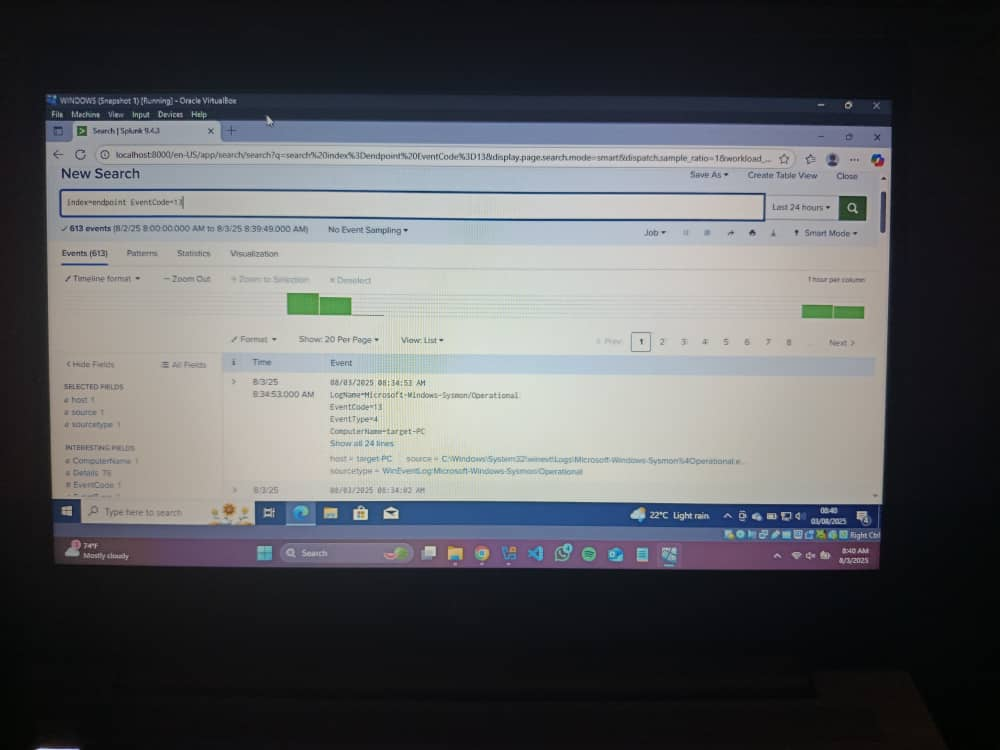

#  Sysmon + MITRE ATT\&CK Mapping 

This project demonstrates how to collect endpoint telemetry using Sysmon and detect adversary behaviors by mapping log events to MITRE ATT\&CK techniques. It simulates attacker behavior on a Windows 10 machine, collects logs, analyzes them, and documents how each maps to a technique in the MITRE ATT\&CK framework.

---

## Tools Used:

- Windows 10 Virtual Machiine with Sysmon installed
- Sysmon for process, registry, network, and DNS logging
- Splunk and Event Viewer for log analysis
- MITRE ATT\&CK Framework for behavior mapping

## Skills Demonstrated

* Endpoint telemetry collection
* Simulated adversarial techniques
* Log analysis using SPL
* Detection engineering
* MITRE ATT\&CK alignment
* SOC documentation

## Steps

- Installation Sysmon on Windows virtual machine
- Simulatation Attacker Behaviors
- Analyzing of Logs in Event Viewer and Splunk
- Creating a MITRE ATT&CK Mapping Report

## MITRE Mapping Table

| # | Behavior                 | Sysmon Event ID | MITRE Technique ID | Description              |
| - | ------------------------ | --------------- | ------------------ | ------------------------ |
| 1 | Encoded PowerShell       | 1               | T1059.001          | PowerShell execution     |
| 2 | Registry Run Key         | 13              | T1547.001          | Persistence via registry |
| 3 | New User Account         | 1               | T1136              | Account creation         |
| 4 | File Download via Script | 1, 11           | T1105              | Remote tool delivery     |
| 5 | DNS Query                | 22              | T1071.004          | DNS C2 communication     |

## Pictures

## Log analysis using splunk

## Log analysis using event viewer

---

